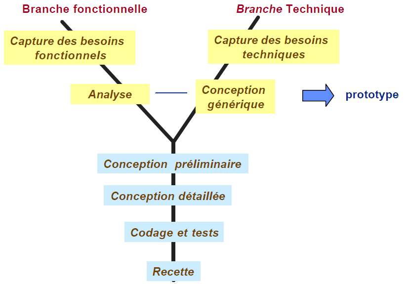
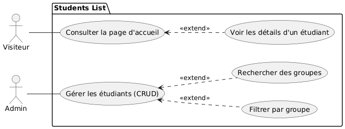
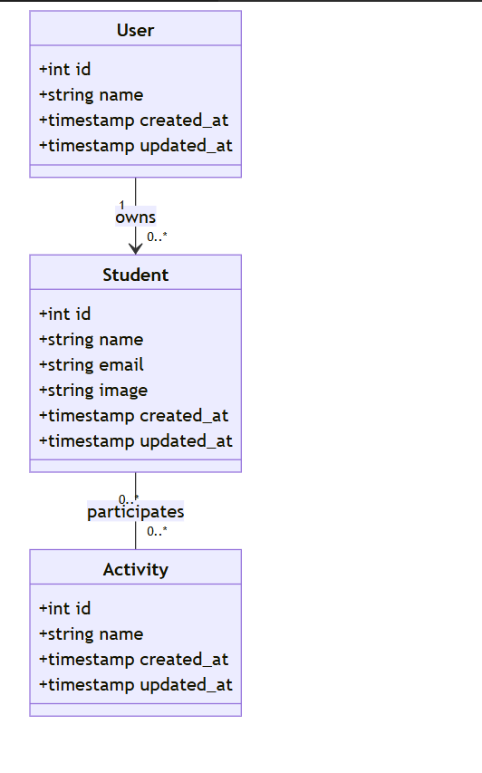

<!-- Add custom CSS styling here if needed -->

# Présentation Projet Technique

### Job skills
- Présentée par : Adnane Kesksu
- Encadré par : M. Essarraj Fouad 

--- 

# Plan

 1. Méthode Waterfall
 2. Exigences : Travail à faire
3. Contexte : Projet de Fin de Formation
4. Analyse Technique
5. Analyse : Analyse Fonctionnelle
6. Conception
7. Versions (v1 - v8)

---
#  La méthode Waterfall (En cascade)

---

## Exigences: Travail à faire

- Développer l'Application Job Skills

- Partie Publique: Interface permettant aux visiteurs de consulter les Emplois. Fonctionnalités : Recherche par titre, filtre par compétences, pagination (10 éléments/page).

- Partie Admin: Tableau de bord sécurisé pour les opérations CRUD. Fonctionnalités : Modales pour ajout/édition, AJAX pour les mises à jour asynchrones.

---

# Contexte: Projet de Fin de Formation

- Projet de Fin de Formation: Travail sur le projet de fin de formation, commençant par la branche technique.

- Processus 2TUP: Le projet suit la méthodologie 2TUP (Processus de développement en Y), séparant les branches Fonctionnelle, Technique et Réalisation.

--- 
 

- Solidification des Compétences: Concentration sur le renforcement des compétences Laravel 12 sans outils d'IA, en s'appuyant sur l'expérience précédente à Solicode.

--- 
# Analyse Technique

## Technologies Utilisées

- 1- Base de données : MySQL
- 2- Framework : Laravel
- 3- Architecture N-tier : Services
- 4- Architecture : MVC
- 5- Moteur de vues : Blade

---

## Technologies Utilisées (suite)

- 6- AJAX : Actions dynamiques
- 7- Upload d'images
- 8- Laravel multilingue
- 9- Vite
- 10- Preline UI Library
- 11- Lucide library

---

# Analyse : Analyse Fonctionnelle

--- 

 # Diagramme de classe

 

--- 

## Historique des Versions

### Version Table

| Version | Description | Branch |
|---------|-------------|--------|
| v1 | Public Side (Consultation, Recherche, Filtre) | `public` |
| v2 | Admin Side (CRUD, Modales) | `admin` |
| v3 | Authentification / Authorization (Gates) | `gates` |
| v4 | SPA / AJAX | `spa-ajax` |
| v5 | SPA / Alpine.js | `spa-alpine` |
| v6 | Spatie / Authorization | `spatie` |
| v7 | API | `api` |
| v8 | Mobile App | `mobile` |

---

## v1 Public Side 

* Live Coding : Creation du portfolio personnel

## v2 Admin Side 

* Live Coding :Gestion des articles (CRUD)

## v3 Authentification / Authorization 

* Live Coding :

---

## v4 SPA / AJAX 
- Live Coding : 
* Un bouton "Ajouter" qui ouvre une modale pour créer un nouvel élément
* Une barre de recherche filtrant des éléments par titre

## v5 SPA / Alpine.js  

* Live Coding :

---

## v6 Spatie / Authorization 

* Live Coding :

## v7 API 

* Live Coding :

## v8 Mobile App 

*  Live Coding

